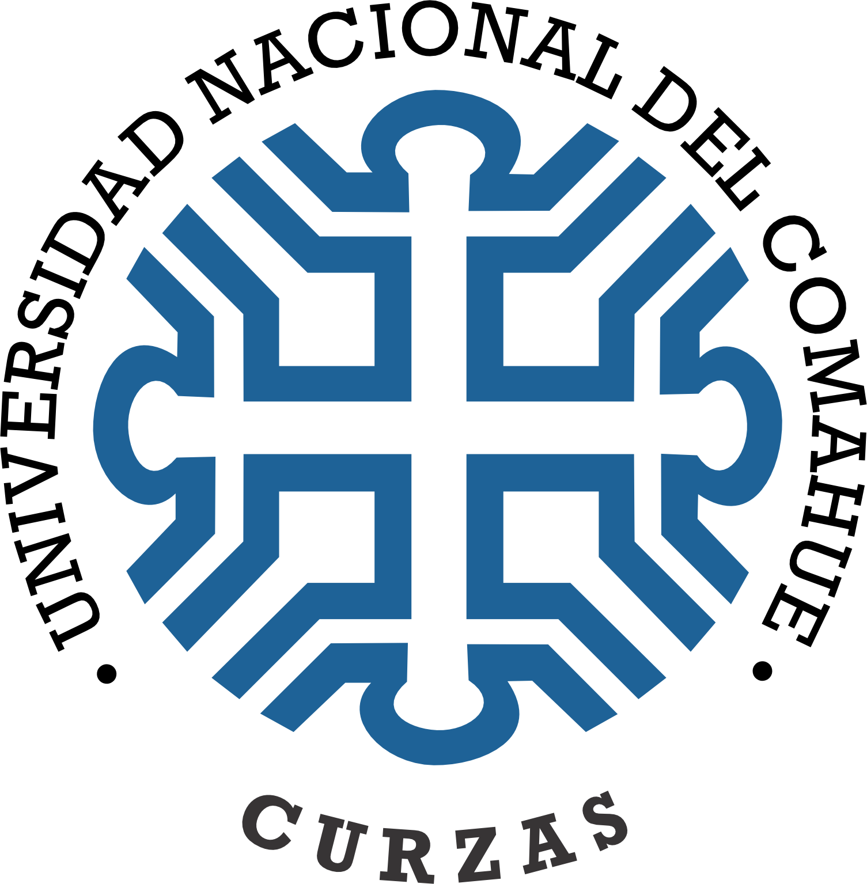

::: {.content-visible when-format="typst"}
```{=typst}
#align(center)[
  #image("assets/img/CURZAS.png", width: 110pt)

  #v(1.2em)

  #text(weight: "bold")[Universidad Nacional del Comahue] \
  #text(weight: "bold")[Complejo Universitario Regional Zona Atlántica y Sur] \
  #text(weight: "bold")[Departamento de Administración Pública]

  #v(3.5em)

  #text(weight: "bold")[Licenciatura en Gestión de Recursos Humanos]
]

#v(3.5em)

#block(inset: (left: 0cm))[
  #set par(justify: false, first-line-indent: 0pt, leading: 0.8em)
  Materia: Seminario de Integración y Aplicación \
  Profesores: Dra. Deborah Noguera \
  #h(5.8em) Esp. Federico Abeiro \
  #h(5.8em) Esp. María Cecilia Aguirre \
  \
  Estudiante: Tec. Sup. en RRHH Héctor Daniel Ayarachi Fuentes \
  DNI y LEGAJO: DNI N° 35.492.138 — Legajo N° 8252 \
  Email: hectordanielayarachifuentes\@gmail.com \
  \
  Director/a: (A designar antes de finalizar el cursado del SIA) \
  Codirector/a: (A designar antes de finalizar el cursado del SIA)
]

#v(4em)

#align(center)[
  Viedma, Río Negro - Año 2026
]
```
:::

::: {.content-visible when-format="docx"}
::: {align="center"}
{width=115px}

<br>

**Universidad Nacional del Comahue**  
**Complejo Universitario Regional Zona Atlántica y Sur**  
**Departamento de Administración Pública**

<br>
<br>
<br>

**Licenciatura en Gestión de Recursos Humanos**
:::

<br>
<br>
<br>

Materia: Seminario de Integración y Aplicación  
Profesores: Dra. Deborah Noguera  
&nbsp;&nbsp;&nbsp;&nbsp;&nbsp;&nbsp;&nbsp;&nbsp;&nbsp;&nbsp;&nbsp;&nbsp;&nbsp;&nbsp;&nbsp;&nbsp;&nbsp;&nbsp;&nbsp;Esp. Federico Abeiro  
&nbsp;&nbsp;&nbsp;&nbsp;&nbsp;&nbsp;&nbsp;&nbsp;&nbsp;&nbsp;&nbsp;&nbsp;&nbsp;&nbsp;&nbsp;&nbsp;&nbsp;&nbsp;&nbsp;Esp. María Cecilia Aguirre  

Estudiante: Tec. Sup. en RRHH Héctor Daniel Ayarachi Fuentes  
DNI y LEGAJO: DNI N° 35.492.138 — Legajo N° 8252  
Email: hectordanielayarachifuentes@gmail.com  

Director/a: (A designar antes de finalizar el cursado del SIA)  
Codirector/a: (A designar antes de finalizar el cursado del SIA)  

<br>
<br>
<br>

::: {align="center"}
Año 2026
:::
:::



```{=typst}
#set page(numbering: none)
#outline(title: [Índice de Contenidos], indent: auto)
```

::: {.content-visible when-format="docx"}
# Índice de Contenidos {.unnumbered}

```{=openxml}
<w:p>
  <w:r>
    <w:fldChar w:fldCharType="begin"/>
    <w:instrText xml:space="preserve"> TOC \o "1-3" \h \z \u </w:instrText>
    <w:fldChar w:fldCharType="separate"/>
    <w:fldChar w:fldCharType="end"/>
  </w:r>
</w:p>
```
:::



```{=typst}
#counter(page).update(1)
#set page(numbering: "1")
#set par(first-line-indent: 1.27cm)

#align(center)[
  #set par(first-line-indent: 0pt)
  #text(weight: "bold", size: 12pt)[Evaluación del Desempeño Docente y Factibilidad de Implementación de un Modelo de Retroalimentación 360° en el Departamento de Administración Pública del CURZAS-UNCo (2025–2026)] \
  #v(0.4em)
  #text(style: "italic", size: 11pt)[Trabajo Práctico N° 2: Primera Parte de la Estructura del Proyecto de Investigación de TFG]
]
#v(1em)
```

::: {.content-visible when-format="docx"}
::: {align="center"}
**Evaluación del Desempeño Docente y Factibilidad de Implementación de un Modelo de Retroalimentación 360° en el Departamento de Administración Pública del CURZAS-UNCo (2025–2026)**  
*(Trabajo Práctico N° 2: Primera Parte de la Estructura del Proyecto de Investigación de TFG)*
:::

<br>
:::

# Tema de Investigación

En esta primera sección del Proyecto de TFG se presenta la delimitación del tema de estudio, articulando la gestión pública universitaria con los modelos teóricos de gestión del empleo y recursos humanos en el sector público.

## Identificación del Tema y Encuadre en el Modelo de Francisco Longo

Este proyecto de investigación se ubica en el cruce disciplinar entre la **Administración Pública** y la **Gestión de Recursos Humanos**. Su abordaje responde a los desafíos actuales de modernización institucional y desarrollo de capacidades estatales en el sector público [@oszlak2020]. Conforme a las pautas del Seminario de Integración y Aplicación (SIA) y a los criterios del Reglamento de Trabajo Final de Graduación [@uncocurzas2023], el tema se delimita mediante el criterio de "pirámide invertida" [@sautu2005], transitando desde el macrosistema de gestión pública hasta el análisis empírico de un problema situado en el ámbito universitario regional.

A nivel teórico, la investigación adopta como marco analítico el **Modelo de Gestión del Empleo Público y Recursos Humanos** de **Francisco @longo2006**. Este modelo concibe la administración de personas como un sistema articulado con la estrategia institucional y compuesto por subsistemas interdependientes:

::: {align="center"}
![*Subsistemas de la Gestión de Recursos Humanos en el Sector Público [@longo2006].*](assets/Sistemas-longo.svg){width=70%}
:::

Dentro de este esquema, el trabajo hace foco en el **Subsistema de Gestión del Rendimiento (Evaluación del Desempeño)**, articulado con tres subsistemas clave: **Gestión del Desarrollo** (capacitación y carrera docente), **Organización del Trabajo** (perfiles y funciones académicas) y **Gestión de las Relaciones Humanas** (clima laboral y cultura participativa). 

El propósito central es indagar si la evaluación docente puede superar la lógica tradicional de control formal o punitivo [@chiavenato2020] para orientarse hacia un enfoque formativo de aprendizaje continuo. Para ello, se analiza la factibilidad de un modelo de **retroalimentación 360 grados**, que articula diversas miradas sobre la labor docente: autoevaluación, valoración de pares disciplinares, apreciación de los estudiantes y seguimiento de directores departamentales [@dalmau2017; @lepsinger2009].

## Descripción Contextual Socioeconómica, Histórica e Institucional

El estudio se sitúa en el **Complejo Universitario Regional Zona Atlántica y Sur (CURZAS)**, unidad académica descentralizada de la **Universidad Nacional del Comahue (UNCo)** en la ciudad de Viedma, capital de Río Negro. A nivel histórico y regulatorio, la Ley N° 24.521 de Educación Superior [@ministerio1995] fijó el mandato de que las universidades nacionales incorporen mecanismos periódicos de autoevaluación y aseguramiento de la calidad en sus tareas de docencia, investigación y extensión.

En este marco, el **Departamento de Administración Pública** cumple una función estratégica en el desarrollo comarcal y provincial. Tiene a su cargo las carreras de Licenciatura en Administración Pública, Licenciatura en Gestión de Recursos Humanos y ciclos de complementación curricular para agentes públicos. Su comunidad estudiantil está conformada tanto por jóvenes de la comarca Viedma-Carmen de Patagones como por trabajadores insertos en organismos públicos de diversa índole.

A esta realidad se suma la consolidación de la **Red de Nodos Universitarios** en localidades de la Línea Sur y la Costa Atlántica rionegrina (tales como Sierra Grande, Valcheta, Los Menucos y Ramos Mexía, entre otras localidades). Esta expansión territorial impone modalidades pedagógicas híbridas que combinan entornos virtuales y encuentros presenciales, lo que demanda de los equipos docentes competencias específicas de tutoría y acompañamiento digital.

En el plano normativo, la actividad docente en el CURZAS se encuentra reglada por el Estatuto de la UNCo [Ordenanza N° 470/2009 y sus modificatorias, @unco2009], el Reglamento de Carrera Docente [Ordenanza N° 0920/2019 y sus normas complementarias, @unco2019] y el Convenio Colectivo de Trabajo Docente homologado por Decreto N° 1246/2015 [@pen2015]. Estos instrumentos fijan mecanismos periódicos de evaluación con fines de permanencia y promoción, que incluyen informes de labor académica, dictámenes de pares y encuestas estudiantiles de fin de cuatrimestre.

A partir de este marco, el proyecto plantea como **supuesto de partida e hipótesis exploratoria** que, en la dinámica cotidiana, dichos dispositivos podrían estar funcionando prioritariamente con un sentido administrativo y sumativo, enfocado en el cumplimiento reglamentario. No obstante, lejos de asumir una conclusión anticipada, **será necesario indagar empíricamente si** estas herramientas operan de manera aislada o si generan instancias efectivas de retroalimentación pedagógica. Examinar si los resultados evaluativos se vinculan efectivamente con planes de capacitación y mejora docente constituye el objetivo central del relevamiento de campo para el período **2025–2026**.

# Delimitación del Objeto Problema

En este apartado se problematiza la evaluación del desempeño docente a partir de la tensión entre el control estatutario y el desarrollo formativo, precisando las delimitaciones metodológicas y las dimensiones de factibilidad.

## Problematización y Construcción del Objeto de Estudio

Construir un problema científico exige desnaturalizar las rutinas cotidianas de la organización para reflexionar sobre sus supuestos teórico-metodológicos [@wainerman2011]. En la educación pública, la evaluación docente suele debatirse entre dos lógicas: el control formal-estatutario y el acompañamiento formativo enfocado en el desarrollo continuo [@longo2006].

En este sentido, la investigación no parte de suponer una falta de mecanismos de evaluación —ya que existen normas y procedimientos vigentes—, sino de indagar la **posible desconexión entre los circuitos de evaluación del rendimiento y las oportunidades reales de desarrollo pedagógico**. Si bien se aplican periódicamente encuestas a estudiantes, **se plantea como hipótesis a contrastar si estos instrumentos son percibidos en la práctica como un trámite formal**, con escasa incidencia en la autoevaluación docente, el diálogo entre pares o la planificación del departamento.

Para responder a este interrogante, la literatura especializada destaca el modelo de **evaluación multiactoral o 360 grados** [@dalmau2017; @lepsinger2009] como una herramienta idónea para articular distintas fuentes de retroalimentación: la reflexión del propio docente, el juicio de colegas de cátedra, la valoración de los estudiantes y el seguimiento institucional.

Conviene advertir que **la evaluación 360° no garantiza resultados formativos de forma automática**. Las investigaciones comparadas señalan que su viabilidad depende de condiciones precisas: anonimato y confidencialidad de los datos, instrumentos pedagógicamente válidos, sensibilización previa de los claustros y un clima institucional de confianza que aleje cualquier percepción de control punitivo.

En una universidad pública cogobernada, es indispensable **diferenciar la evaluación orientada a la mejora pedagógica de aquella vinculada a decisiones laborales sumativas** (como la permanencia o promoción regladas por la Ordenanza N° 0920/2019 y modificatorias, y el CCT Docente, Decreto N° 1246/2015). Trasladar herramientas de gestión sin cuidar esta frontera o sin el acuerdo de los claustros podría despertar comprensibles prevenciones. Por eso, la viabilidad de cualquier propuesta descansa en la **gobernanza universitaria**: un espacio colegiado donde las políticas de gestión de personas se construyen sobre *variables de control compartido* [@matus1993; @longo2006].

## Desglose de las Cuatro (4) Delimitaciones Metodológicas

Siguiendo las pautas de la cátedra, la delimitación del problema comprende cuatro dimensiones constitutivas:

1. **Delimitación Temática:** Mecanismos de estructuración de la evaluación del desempeño docente y análisis de factibilidad para implementar un modelo de retroalimentación multiactoral (360°), articulando autoevaluación, valoración de pares, opinión de estudiantes y seguimiento departamental.
2. **Delimitación Semántica y Teórica:** Precisión de conceptos estructurantes: *Evaluación del Desempeño Docente* (apreciación formativa del quehacer pedagógico en el subsistema de rendimiento); *Modelo 360° / Retroalimentación Multiactoral* (dispositivo de consulta y triangulación de juicios valorativos); *Gobernanza Universitaria* [cogobierno, diálogo paritario y control compartido de variables institucionales; @matus1993]; y *Gestión del Desarrollo* [aprendizaje continuo y formación pedagógica articulada; @longo2006].
3. **Delimitación Temporal:** Período de investigación **2025–2026**, organizado en dos etapas:
   * **Fase preliminar y documental (2025):** Formulación del problema, revisión bibliográfica sistemática sobre evaluación 360°, análisis normativo institucional (Estatuto UNCo, Ordenanzas CS N° 470/2009 y N° 0920/2019 con sus modificatorias, y CCT Docente Decreto N° 1246/2015) y diseño metodológico.
   * **Fase empírica y propositiva (2026):** Trabajo de campo mediante entrevistas a autoridades y docentes, encuestas a estudiantes, análisis multidimensional de factibilidad e informe final de Tesina para el Seminario de Integración y Aplicación (SIA).
4. **Delimitación Geográfica e Institucional:** Departamento de Administración Pública, Complejo Universitario Regional Zona Atlántica y Sur (CURZAS), Universidad Nacional del Comahue, ciudad de Viedma, Río Negro.

## Operacionalización de las Dimensiones de Factibilidad

### Definición Conceptual y Operativa de Factibilidad

En el marco de la gestión pública universitaria, la **factibilidad** en esta investigación no se concibe como una viabilidad técnica abstracta ni como una imposición gerencial vertical. Se define operativamente como la **convergencia de condiciones normativas, organizacionales, técnicas y de legitimidad institucional que permitan implementar un modelo de retroalimentación 360° con sentido formativo y sin vulnerar derechos laborales adquiridos**.

En términos prácticos, determinar si el modelo es factible en el Departamento de Administración Pública del CURZAS implica responder a cuatro interrogantes centrales:
1. **Compatibilidad jurídica:** ¿Puede aplicarse con fines formativos sin colisionar con la estabilidad laboral regulada por el Estatuto UNCo, la Carrera Docente (Ord. N° 0920/2019 y modificatorias) y el CCT Docente (Decreto N° 1246/2015)?
2. **Capacidad técnica y de gestión:** ¿Existen plataformas informáticas (SIU-Guaraní, campus virtual) y circuitos administrativos capaces de resguardar el anonimato y procesar devoluciones oportunas?
3. **Aceptación y confianza de los claustros:** ¿Existe disposición en docentes, estudiantes y autoridades para participar en una evaluación multiactoral, disipando temores a controles punitivos?
4. **Legitimidad en el cogobierno:** ¿Cuenta la propuesta con viabilidad política para ser tratada y consensuada en los órganos colegiados sobre variables de control compartido [@matus1993; @longo2006]?

### Dimensiones de Observación y Fuentes Empíricas

Para contrastar estos aspectos en el trabajo de campo, la investigación desagrega la factibilidad en cinco dimensiones observables:

| Dimensión de Factibilidad | Criterios y Aspectos a Observar | Indicadores y Fuentes Empíricas |
| :--- | :--- | :--- |
| **Normativa y Estatutaria** | Compatibilidad con el Estatuto UNCo (Ord. 470/2009 y modif.), la Carrera Docente (Ord. N° 0920/2019 y modificatorias) y el CCT Docente (Decreto N° 1246/2015) | Análisis documental normativo; ausencia de colisión con la estabilidad y derechos adquiridos |
| **Técnica e Instrumental** | Disponibilidad de plataformas digitales, recursos informáticos y diseño pedagógico de instrumentos | Relevamiento de entornos virtuales (SIU-Guaraní, campus virtual); validez y confidencialidad técnica |
| **Organizacional y Procedimental** | Roles departamentales, comisiones curriculares, circuitos de devolución y tiempos de gestión | Procedimientos administrativos instituidos; capacidad de canalizar la retroalimentación formativa |
| **Cultural y Actitudinal** | Nivel de confianza institucional, cultura participativa y disposición de los claustros ante la coevaluación | Cuestionarios y entrevistas; percepción de utilidad pedagógica y eventuales prevenciones frente al control sumativo |
| **Gobernanza y Política Institucional** | Participación y legitimación en el cogobierno (Consejo Directivo y Departamental) y mesas paritarias | Acuerdos colegiados; consulta a representaciones gremiales sobre variables de control compartido |

### Criterios Cualitativos para la Interpretación de Resultados

Para valorar las conclusiones del relevamiento empírico sin recurrir a mediciones forzadas, la investigación establece tres categorías cualitativas de interpretación:

* **Factibilidad Alta (Favorable):** Se verifica cuando existe compatibilidad normativa plena, soporte tecnológico adecuado, disposición favorable de los tres claustros (docentes, alumnos y directores) y viabilidad de tratamiento colegiado en el cogobierno.
* **Factibilidad Condicionada (Media / Viable con adecuaciones):** Se constata cuando no existen impedimentos jurídicos ni rechazo de fondo, pero la aplicación requiere pasos previos de gestión institucional: acuerdos paritarios específicos sobre confidencialidad, adecuación de plataformas digitales, instancias de sensibilización docente o implementación gradual mediante pruebas piloto.
* **Factibilidad Baja (Desfavorable / Inviable):** Se determina ante la presencia de barreras estructurales no superables en el corto plazo, tales como colisión con el régimen estatutario de carrera docente, desconfianza generalizada en los claustros o carencia absoluta de soporte técnico y administrativo.

## Pregunta General de Investigación

A partir de las precisiones metodológicas señaladas, se formula el interrogante central de la investigación:

> **¿De qué manera se estructuran los mecanismos de evaluación del desempeño docente y qué factibilidad presenta la implementación de un modelo de retroalimentación 360° en el Departamento de Administración Pública del CURZAS-UNCo (2025–2026)?**

# Justificación y Relevancia de la Investigación

A continuación, se explicita la pertinencia del estudio desde tres planos convergentes, en estricta consonancia con los criterios formales del Reglamento de TFG de la universidad:

## Plano Cognitivo y Disciplinar

En el plano teórico, el trabajo busca aportar al campo de la Administración Pública y la Gestión de Recursos Humanos en el sector estatal, dialogando con los enfoques sobre modernización y capacidades institucionales [@oszlak2020]. La implementación de modelos de retroalimentación 360° en universidades públicas argentinas —con estructuras de cogobierno, autonomía y regímenes paritarios específicos— representa un área de vacancia que amerita ser investigada de forma situada.

Asimismo, la investigación operacionaliza el Subsistema de Gestión del Rendimiento de @longo2006 en una universidad patagónica. Se examina en qué condiciones la evaluación docente puede orientarse al aprendizaje continuo, generando evidencia empírica sobre la articulación entre gobernanza colegiada y dispositivos de retroalimentación en organizaciones públicas complejas.

## Plano Social e Institucional

A nivel social e institucional, el trabajo ofrece un valor concreto al CURZAS y a la UNCo al producir un diagnóstico riguroso sobre la viabilidad de renovar las prácticas evaluativas. En caso de constatarse su factibilidad, la retroalimentación multiactoral podría fortalecer la cultura de mejora continua y transparencia en la educación superior pública.

Asimismo, la investigación considera las expectativas y percepciones de los distintos claustros:
- **Cuerpo docente:** Permite conocer si la autoevaluación y el intercambio reflexivo entre pares son valorados como un apoyo formativo para la Carrera Docente (Ord. N° 0920/2019 y modificatorias; CCT Docente, Decreto N° 1246/2015), o si generan reparos frente a sobrecargas de tareas o al uso de la información.
- **Claustro estudiantil:** Indaga la disposición de los estudiantes para que su opinión trascienda la encuesta administrativa de cierre lectivo y se convierta en un insumo constructivo para mejorar la enseñanza.
- **Autoridades departamentales:** Posibilita diagnosticar las capacidades técnicas y de gestión necesarias para procesar juicios evaluativos múltiples e integrarlos a la planificación académica y a los planes de capacitación.

## Plano Personal y Profesional

En el orden formativo, el proyecto articula la Licenciatura en Gestión de Recursos Humanos con la formación previa como Técnico Superior en Recursos Humanos y los marcos de la Administración Pública. Permite consolidar habilidades de diagnóstico organizacional e investigación aplicada en el ámbito universitario regional, reafirmando el compromiso ético con el fortalecimiento de la universidad pública en la Patagonia.

# Definición de Objetivos del TFG

En este apartado se formulan las metas analíticas del proyecto en congruencia directa con la pregunta general de investigación y las dimensiones metodológicas planteadas:

## Objetivo General

* **Analizar** los mecanismos de estructuración de la evaluación del desempeño docente y determinar las condiciones de factibilidad organizacional, técnica, normativa y de gobernanza para la eventual implementación de un modelo de retroalimentación multiactoral (360°) en el Departamento de Administración Pública del CURZAS-UNCo (2025–2026).

## Objetivos Específicos

1. **Relevar y caracterizar** los instrumentos normativos, procedimientos y prácticas vigentes aplicadas a la evaluación del desempeño docente en el Departamento de Administración Pública del CURZAS-UNCo, distinguiendo las prescripciones estatutarias de su implementación efectiva.
2. **Explorar las percepciones, disposiciones y expectativas** de los distintos claustros involucrados (docentes, estudiantes y directores de departamento) respecto a la retroalimentación multiactoral (360°) y las condiciones de confianza institucional requeridas.
3. **Identificar los condicionantes técnico-organizacionales, normativos y de gobernanza** (acuerdos paritarios, Carrera Docente según Ord. N° 0920/2019 y sus modificatorias, confidencialidad y cogobierno) que inciden en la factibilidad del modelo.
4. **Proponer lineamientos orientativos** para una eventual implementación de un modelo de retroalimentación multiactoral (360°), en función de las condiciones y límites de factibilidad identificados en la investigación empírica.

## Matriz de Consistencia Metodológica y Articulación con Longo (2006)

Para dotar de consistencia analítica a la investigación, cada subsistema del modelo de @longo2006 aporta una clave interpretativa específica al problema planteado:
* **Gestión del Rendimiento:** actúa como eje estructurante para examinar los mecanismos evaluativos vigentes y explorar su potencial transformación hacia una lógica formativa e integral.
* **Organización del Trabajo:** permite contrastar los perfiles, funciones docentes y exigencias pedagógicas (presenciales e híbridas en los nodos territoriales) con los criterios reales de evaluación.
* **Gestión del Desarrollo:** analiza la articulación efectiva entre los resultados evaluativos y los planes de capacitación continua, perfeccionamiento didáctico y carrera docente.
* **Gestión de las Relaciones Humanas y Sociales:** indaga el clima laboral, la confianza interclaustros y los acuerdos paritarios indispensables para legitimar la coevaluación y disipar temores al control punitivo.

En consecuencia, el modelo de Longo no se utiliza únicamente como encuadre teórico, sino como criterio de lectura para analizar la articulación entre evaluación del desempeño, desarrollo de capacidades docentes, organización del trabajo y relaciones institucionales, permitiendo identificar condiciones que favorecen o limitan la factibilidad de una retroalimentación 360°.

| Nivel de Objetivo | Dimensión y Acción Metodológica | Subsistema de RR.HH. (Longo, 2006) | Fuente, Actor e Instrumento Previsto |
| :--- | :--- | :--- | :--- |
| **General** | **Factibilidad integral:** Análisis multidimensional de mecanismos actuales y viabilidad de retroalimentación 360° | **Gestión del rendimiento** (*Evaluación del desempeño y retroalimentación formativa*) | Claustros y autoridades del Departamento de Administración Pública (CURZAS-UNCo) |
| **Específico 1** | **Dimensión normativa-institucional:** Relevamiento y análisis documental de ordenanzas, reglamentos y prácticas vigentes | **Gestión del rendimiento en articulación con Organización del trabajo** (*Evaluación vigente y perfiles/funciones docentes según Estatuto y Ord. N° 0920/2019 y modificatorias*) | Estatuto UNCo (Ord. 470/2009 y modif.), Ord. N° 0920/2019 (y modif.) y CCT Docente (Decreto N° 1246/2015) (Matriz de análisis documental) |
| **Específico 2** | **Dimensión intersubjetiva-cultural:** Exploración de percepciones, disposiciones y expectativas ante la evaluación 360° | **Gestión de las relaciones humanas y sociales** (*Cultura participativa, clima laboral y diálogo interclaustro*) | Docentes, estudiantes y directores de departamento (Guías de entrevista y cuestionarios diagnósticos) |
| **Específico 3** | **Dimensión técnico-viabilidad:** Identificación de condicionantes paritarios, procedimentales, gremiales y de confidencialidad | **Gestión de las relaciones humanas (paritarias) en articulación con Gestión del empleo** (*Condiciones de trabajo, estabilidad y Carrera Docente - Dec. N° 1246/2015 y Ord. N° 0920/2019 y modif.*) | Representantes docentes y autoridades académicas (Matriz de análisis de viabilidad institucional) |
| **Específico 4** | **Dimensión propositiva-orientativa:** Proposición de lineamientos orientativos para una eventual aplicación formativa | **Gestión del desarrollo** (*Capacitación, aprendizaje continuo y mejora pedagógica*) | Síntesis analítica del proyecto adaptada al contexto institucional del CURZAS (Esquema metodológico orientativo) |



# Referencias {.unnumbered}

::: {#refs}
:::
