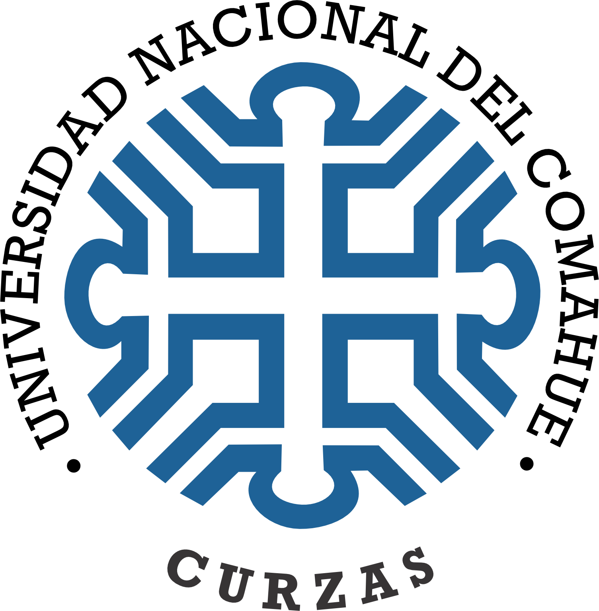

::: {.content-visible when-format="typst"}
```{=typst}
#align(center)[
  #image("assets/img/CURZAS.png", width: 110pt)

  #v(1.2em)

  #text(weight: "bold")[Universidad Nacional del Comahue] \
  #text(weight: "bold")[Complejo Universitario Regional Zona Atlántica y Sur] \
  #text(weight: "bold")[Departamento de Administración Pública]

  #v(3.5em)

  #text(weight: "bold")[Licenciatura en Gestión de Recursos Humanos]
]

#v(3.5em)

#block(inset: (left: 0cm))[
  #set par(justify: false, first-line-indent: 0pt, leading: 0.8em)
  Materia: Seminario de Integración y Aplicación \
  Profesores: Dra. Deborah Noguera \
  #h(5.8em) Esp. Federico Abeiro \
  #h(5.8em) Esp. María Cecilia Aguirre \
  \
  Estudiante: Tec. Sup. en RRHH Héctor Daniel Ayarachi Fuentes \
  DNI y LEGAJO: DNI N° 35.492.138 — Legajo N° 8252 \
  Email: hectordanielayarachifuentes\@gmail.com \
  \
  Director/a: (A designar antes de finalizar el cursado del SIA) \
  Codirector/a: (A designar antes de finalizar el cursado del SIA)
]

#v(4em)

#align(center)[
  Año 2026
]
```
:::

::: {.content-visible when-format="docx"}
::: {align="center"}
{width=115px}

<br>

**Universidad Nacional del Comahue**  
**Complejo Universitario Regional Zona Atlántica y Sur**  
**Departamento de Administración Pública**

<br>
<br>
<br>

**Licenciatura en Gestión de Recursos Humanos**
:::

<br>
<br>
<br>

Materia: Seminario de Integración y Aplicación  
Profesores: Dra. Deborah Noguera  
&nbsp;&nbsp;&nbsp;&nbsp;&nbsp;&nbsp;&nbsp;&nbsp;&nbsp;&nbsp;&nbsp;&nbsp;&nbsp;&nbsp;&nbsp;&nbsp;&nbsp;&nbsp;&nbsp;Esp. Federico Abeiro  
&nbsp;&nbsp;&nbsp;&nbsp;&nbsp;&nbsp;&nbsp;&nbsp;&nbsp;&nbsp;&nbsp;&nbsp;&nbsp;&nbsp;&nbsp;&nbsp;&nbsp;&nbsp;&nbsp;Esp. María Cecilia Aguirre  

Estudiante: Tec. Sup. en RRHH Héctor Daniel Ayarachi Fuentes  
DNI y LEGAJO: DNI N° 35.492.138 — Legajo N° 8252  
Email: hectordanielayarachifuentes@gmail.com  

Director/a: (A designar antes de finalizar el cursado del SIA)  
Codirector/a: (A designar antes de finalizar el cursado del SIA)  

<br>
<br>
<br>

::: {align="center"}
Año 2026
:::
:::



```{=typst}
#set page(numbering: none)
#show outline.entry: set text(size: 9.2pt)
#outline(title: [Índice de Contenidos], indent: auto)
```

::: {.content-visible when-format="docx"}
# Índice de Contenidos {.unnumbered}

```{=openxml}
<w:p>
  <w:r>
    <w:fldChar w:fldCharType="begin"/>
    <w:instrText xml:space="preserve"> TOC \o "1-3" \h \z \u </w:instrText>
    <w:fldChar w:fldCharType="separate"/>
    <w:fldChar w:fldCharType="end"/>
  </w:r>
</w:p>
```
:::



```{=typst}
#counter(page).update(1)
#set page(numbering: "1")
#set par(first-line-indent: 1.27cm)

#align(center)[
  #set par(first-line-indent: 0pt)
  #text(weight: "bold", size: 12pt)[Evaluación del Desempeño Docente y Factibilidad de Implementación de un Modelo de Retroalimentación 360° en el Departamento de Administración Pública del CURZAS-UNCo (2025–2026)] \
  #v(0.4em)
  #text(style: "italic", size: 11pt)[Trabajo Práctico N° 3: Estructura del Proyecto de Investigación de TFG]
]
#v(1em)
```

::: {.content-visible when-format="docx"}
::: {align="center"}
**Evaluación del Desempeño Docente y Factibilidad de Implementación de un Modelo de Retroalimentación 360° en el Departamento de Administración Pública del CURZAS-UNCo (2025–2026)**  
*(Trabajo Práctico N° 3: Estructura del Proyecto de Investigación de TFG)*
:::

<br>
:::

# Primera parte de la estructura del Proyecto de investigación de TFG

## Tema de Investigación

En esta primera sección del Proyecto de TFG se presenta la delimitación del tema de estudio, articulando la gestión pública universitaria con los modelos teóricos de gestión del empleo y recursos humanos en el sector público.

### Identificación del Tema y Encuadre en el Modelo de Francisco Longo

Este proyecto de investigación se ubica en el cruce disciplinar entre la Administración Pública y la Gestión de Recursos Humanos. Su abordaje responde a los desafíos actuales de modernización institucional y desarrollo de capacidades estatales en el sector público [@oszlak2020]. Conforme a las pautas del Seminario de Integración y Aplicación (SIA) y a los criterios del Reglamento de Trabajo Final de Graduación [Resolución CD-CURZAS N° 266/23; @uncocurzas2023], el tema se delimita mediante el criterio de "pirámide invertida" [@sautu2005], transitando desde el macrosistema de gestión pública hasta el análisis empírico de un problema situado en el ámbito universitario regional.

A nivel teórico, la investigación adopta como marco analítico el modelo de gestión del empleo público y recursos humanos de Francisco @longo2006. Este modelo concibe la administración de personas como un sistema articulado con la estrategia institucional y compuesto por subsistemas interdependientes:

::: {align="center"}
![*Subsistemas de la Gestión de Recursos Humanos en el Sector Público [@longo2006].*](assets/Sistemas-longo.svg){width=52%}
:::

En el modelo propuesto por @longo2006, la presente investigación focaliza en el subsistema de gestión del rendimiento (evaluación del desempeño), articulado con tres subsistemas clave: gestión del desarrollo (capacitación y carrera docente), organización del trabajo (perfiles y funciones académicas) y gestión de las relaciones humanas y sociales (clima laboral y cultura participativa).

El propósito central es indagar si la evaluación docente puede superar la lógica tradicional de control formal o punitivo [@chiavenato2020] para orientarse hacia un enfoque formativo de aprendizaje continuo. Para lograrlo, la investigación examina la factibilidad de un modelo de retroalimentación 360 grados adaptado al ámbito de la educación superior [@obando2014; @sifuentes2016]. La singularidad de esta propuesta radica en situar dicho modelo en una universidad pública patagónica signada por el cogobierno colegiado, la negociación paritaria y la atención a entornos híbridos de enseñanza en su Red de Nodos Territoriales, articulando la mirada del propio docente, de los colegas de cátedra, de los estudiantes y de las autoridades departamentales.

### Descripción Contextual Socioeconómica, Histórica e Institucional

El estudio se sitúa en el Complejo Universitario Regional Zona Atlántica y Sur (CURZAS), unidad académica descentralizada de la Universidad Nacional del Comahue (UNCo) en la ciudad de Viedma, capital de la Provincia de Río Negro. A nivel histórico y regulatorio, la Ley N° 24.521 de Educación Superior [@ministerio1995] fijó el mandato de que las universidades nacionales incorporen mecanismos periódicos de autoevaluación y aseguramiento de la calidad en sus tareas de docencia, investigación y extensión.

En este marco, el Departamento de Administración Pública cumple una función estratégica en el desarrollo regional y provincial. Tiene a su cargo las carreras de Licenciatura en Administración Pública, Licenciatura en Gestión de Recursos Humanos y ciclos de complementación curricular para agentes públicos. Su comunidad estudiantil está conformada tanto por jóvenes y personas provenientes de las ciudades de Viedma (Provincia de Río Negro) y Carmen de Patagones (Provincia de Buenos Aires), como por trabajadores insertos en organismos públicos de diversa índole.

A esta realidad se suma la consolidación de la Red de Nodos Universitarios en localidades de la Línea Sur y la Costa Atlántica rionegrina (tales como Sierra Grande, Valcheta, Los Menucos y Ramos Mexía, entre otras localidades). Esta expansión territorial impone modalidades pedagógicas híbridas que combinan entornos virtuales y encuentros presenciales, lo que demanda de los equipos docentes competencias específicas de tutoría y acompañamiento digital.

En el plano normativo, la actividad docente en el CURZAS —definido estatutariamente como Complejo Universitario Regional (Art. 17 y Disposición Transitoria Cuarta del nuevo Estatuto)— se encuentra reglada por el Estatuto de la UNCo (Ordenanza CS N° 0988/2025, texto ordenado) [@unco2025], el Reglamento de Carrera Docente (Ordenanza CS N° 0910/1997 y modificatorias hasta la Ord. CS N° 0887/2021) [@unco1997] y el Convenio Colectivo de Trabajo Docente (Decreto N° 1246/2015) [@pen2015]. Estos instrumentos fijan el régimen de ingreso y ascenso mediante concursos públicos de antecedentes y oposición (Arts. 66 y 69), así como la evaluación obligatoria de la inserción y permanencia docente (Art. 73) a través de dos mecanismos estatutarios: informes anuales (que incluyen plan de trabajo, avance, opinión de la Dirección del Departamento y encuestas estudiantiles obligatorias, Art. 74) y evaluaciones cuatrienales a cargo de un tribunal integrado por dos evaluadores externos de la disciplina y un integrante del claustro estudiantil (Art. 75, inc. a).

A partir de este marco, el proyecto plantea como supuesto orientador de investigación [@sautu2005] que, en la dinámica cotidiana, dichos dispositivos estatutarios podrían estar funcionando prioritariamente con un sentido administrativo y sumativo, enfocado en la acreditación reglamentaria de permanencia. No obstante, lejos de asumir una conclusión anticipada, será necesario indagar empíricamente si estas herramientas generan instancias efectivas de retroalimentación pedagógica y si sus resultados se vinculan efectivamente con planes de formación docente para el período 2025–2026.

## Delimitación del Objeto Problema

En este apartado se problematiza la evaluación del desempeño docente a partir de la tensión entre el control estatutario y el desarrollo formativo, precisando las delimitaciones metodológicas y las dimensiones de factibilidad.

### Problematización y Construcción del Objeto de Estudio

Construir un problema científico exige desnaturalizar las rutinas cotidianas de la organización para reflexionar sobre sus supuestos teórico-metodológicos [@wainerman2011]. En la educación pública, la evaluación docente suele debatirse entre dos lógicas: el control formal-estatutario y el acompañamiento formativo enfocado en el desarrollo continuo [@longo2006].

En este sentido, la investigación no parte de suponer la inexistencia de mecanismos de evaluación —ya que existen normas y procedimientos vigentes—, sino de indagar la posible desconexión entre los circuitos de evaluación del rendimiento y las oportunidades reales de desarrollo pedagógico. Se formula como supuesto orientador de investigación [@sautu2005] que estos instrumentos podrían ser percibidos en la práctica como un trámite formal, con escasa incidencia en la autoevaluación docente, el diálogo entre pares o la planificación del departamento.

Para responder a este interrogante, la literatura sobre evaluación docente en el nivel universitario [@obando2014] destaca el modelo de retroalimentación multiactoral o 360 grados como un dispositivo valioso para articular la autoevaluación reflexiva del profesorado, el juicio de valor entre pares, la apreciación estudiantil y la valoración de las autoridades académicas.

En una universidad pública cogobernada, es indispensable diferenciar la evaluación orientada a la mejora pedagógica de aquella vinculada a decisiones laborales sumativas. Dado que el Estatuto sanciona que dos evaluaciones cuatrienales consecutivas negativas determinan la vacancia del cargo y llamado a concurso público —continuando el o la docente en funciones hasta la cobertura por concurso— (Art. 75, inc. c), existe una comprensible prevención docente frente a controles auditadores. Si bien la normativa vigente ya contempla la opinión de la Dirección del Departamento en los informes anuales del legajo académico (Art. 74), la singularidad de este proyecto radica en analizar la factibilidad de un circuito de retroalimentación 360° que se plantea, como hipótesis de diseño preliminar, bajo un carácter formativo, confidencial e independiente del legajo sumativo.

Dicho dispositivo buscaría articular las valoraciones de los diversos actores institucionales (cuerpo docente y comunidad estudiantil) y de la Dirección del Departamento —elegida por los integrantes del departamento por un período de dos años (Art. 14)— para alimentar de forma directa el Programa Anual de Formación de Recursos Humanos del Departamento (Art. 76) y el perfeccionamiento continuo de la Carrera Docente (Art. 65). En este marco, la investigación propone indagar de qué modo la gobernanza universitaria —entendida como un espacio colegiado donde las decisiones se construyen sobre *variables de control compartido* [@matus1993; @longo2006], incide sobre las posibilidades reales de consensuar y legitimar este tipo de dispositivos formativos.

### Desglose de las Cuatro (4) Delimitaciones Metodológicas

Siguiendo las pautas metodológicas de la cátedra de Seminario de Integración y Aplicación, la delimitación del objeto problema comprende cuatro dimensiones analíticas:

* **Delimitación Temática y Conceptual:** El objeto de estudio es la factibilidad de implementación de un modelo de retroalimentación 360° en la evaluación del desempeño docente. Se analiza desde la articulación entre cuatro subsistemas de Francisco Longo [-@longo2006]: gestión del rendimiento, gestión del desarrollo, organización del trabajo y relaciones humanas y sociales.
* **Delimitación Espacial:** La investigación se circunscribe a la sede central del CURZAS (Viedma, Provincia de Río Negro) y a la Red de Nodos Universitarios de la Línea Sur y la Costa Atlántica rionegrina^[La recolección empírica contemplará de manera diferenciada a la comunidad académica de los Nodos Territoriales (Sierra Grande, Valcheta, Los Menucos y Ramos Mexía), administrando cuestionarios digitales y entrevistas a docentes tutores y estudiantes que cursan bajo la modalidad híbrida reglamentada por la Res. CD-CURZA N° 196/2022.] donde el Departamento de Administración Pública despliega carreras y tutorías pedagógicas.
* **Delimitación Temporal:** El período de análisis empírico comprende el bienio 2025–2026. Esta ventana temporal coincide con el período lectivo de cursado y elaboración del TFG, permitiendo indagar las prácticas de evaluación en el marco normativo del nuevo Estatuto UNCo (Ord. CS N° 0988/2025) y los desafíos pedagógicos de pospandemia.
* **Delimitación Poblacional y Organizacional:** La unidad de análisis organizacional es el Departamento de Administración Pública del CURZAS-UNCo. La población involucrada comprende:
  * Docentes regulares e interinos de las carreras del Departamento.
  * Estudiantes regulares que cursan asignaturas de dichas carreras.
  * Autoridades departamentales (Director/a de Departamento y miembros del Consejo Departamental).

### Operacionalización de las Dimensiones de Factibilidad

Dado que el objetivo general del proyecto consiste en analizar la viabilidad de un modelo 360°, resulta indispensable precisar qué se entiende por factibilidad en esta investigación y qué criterios permitirán interpretar los resultados del trabajo de campo.

#### Definición Conceptual y Operativa de Factibilidad

En el marco de la gestión pública y la planificación estratégica [@matus1993; @longo2006], la **factibilidad** no se reduce a una viabilidad formal o teórica. Representa el grado de adecuación y compatibilidad real entre una innovación propuesta y las condiciones organizacionales, normativas, técnicas y políticas del contexto donde se pretende implementar.

Desde una perspectiva operativa, evaluar la factibilidad implica indagar si se verifican las condiciones indispensables para que el modelo pueda desplegarse sin distorsionar sus fines pedagógicos ni vulnerar garantías estatutarias vigentes. Esta indagación contempla cinco dimensiones analíticas interrelacionadas, correspondientes punto por punto con los interrogantes centrales de viabilidad:

1. **Factibilidad Normativa y Estatutaria:** ¿Puede aplicarse con fines formativos sin colisionar con la estabilidad laboral regulada por el Estatuto UNCo (Ordenanza CS N° 0988/2025), el Reglamento de Carrera Docente (Ordenanza CS N° 0910/1997 y modificatorias) y el Convenio Colectivo de Trabajo Docente (Decreto PEN N° 1246/2015)? [@unco2025; @unco1997; @pen2015].
2. **Factibilidad Técnica e Instrumental:** ¿Existen plataformas informáticas accesibles (SIU-Guaraní, campus virtual Moodle) e instrumentos pedagógicamente válidos capaces de procesar la retroalimentación multiactoral resguardando rigurosamente el anonimato? [@obando2014; @sifuentes2016].
3. **Factibilidad Organizacional y Procedimental:** ¿Cuenta el Departamento con circuitos administrativos, roles institucionales idóneos y tiempos de gestión adecuados para procesar las devoluciones diagnósticas y articularlas con el Programa Anual de Capacitación Docente (Art. 76 del Estatuto UNCo)? [@longo2006].
4. **Factibilidad Cultural y Actitudinal:** ¿Existe confianza institucional, cultura participativa y disposición favorable en los actores involucrados (docentes y estudiantes) y en las autoridades departamentales para participar en una evaluación multiactoral, disipando prevenciones frente al control jerárquico punitivo? [@lepsinger2009; @reyes2020].
5. **Factibilidad de Gobernanza y Diálogo Institucional (Poligobernanza Multinivel):** ¿Cuenta la propuesta con viabilidad política para ser deliberada, legitimada y consensuada en los órganos de cogobierno (Consejo Directivo y Consejos Departamentales) y en las mesas paritarias docentes sobre variables de control compartido? [@cao2023; @brunner2011; @matus1993].

#### Dimensiones de Observación y Fuentes Empíricas

Para contrastar estos aspectos en el trabajo de campo, la investigación desagrega la factibilidad en cinco dimensiones observables con criterios, fuentes e indicadores específicos:

| Dimensión de Factibilidad | Criterios y Aspectos a Observar | Indicadores y Fuentes Empíricas |
| :--- | :--- | :--- |
| **Normativa y Estatutaria** | Compatibilidad con el Estatuto UNCo (Ord. CS N° 0988/2025), la Carrera Docente (Ord. CS N° 0910/1997 y modificatorias) y el CCT Docente (Decreto PEN N° 1246/2015) | Análisis documental normativo; ausencia de colisión con la estabilidad laboral y resguardo del carácter no sumativo del circuito formativo |
| **Técnica e Instrumental** | Disponibilidad de plataformas digitales (Moodle, SIU-Guaraní), validez de los reactivos y confiabilidad técnica | Relevamiento de entornos virtuales; procesamiento automatizado de datos, mitigando la sobrecarga y garantizando el anonimato^[A fin de mitigar la fatiga evaluativa y la sobrecarga técnica, se proyecta un instrumento modular y conciso (no mayor a 15–20 reactivos focalizados en escalas Likert con espacio para sugerencias cualitativas), con periodicidad anual desvinculada de las encuestas estudiantiles sumativas obligatorias (Obando Freire et al., 2014).] |
| **Organizacional y Procedimental** | Roles departamentales, comisiones curriculares, circuitos de devolución formativa y tiempos de gestión administrativa | Entrevistas a autoridades y personal de gestión académica; capacidad procedimental para canalizar los diagnósticos hacia el Programa Anual de Formación (Art. 76) |
| **Cultural y Actitudinal** | Nivel de confianza institucional, cultura participativa, disposición ante la coevaluación y superación de temores al control auditador | Cuestionarios y entrevistas semiestructuradas a docentes y estudiantes; percepción de utilidad pedagógica, apertura a la retroalimentación y resguardo en cátedras reducidas^[Para salvaguardar el anonimato en asignaturas con equipos docentes unipersonales o de reducida integración, el dispositivo prevé procesar los datos de forma agregada por áreas disciplinares o ciclos formativos, evitando cualquier reporte individualizado que comprometa la confidencialidad entre pares (Longo, 2006; Lepsinger & Lucia, 2009).] |
| **Gobernanza y Diálogo Institucional (Poligobernanza)** | Legitimación en los órganos colegiados de cogobierno (Consejo Directivo del CURZAS y Consejo Superior) y mesas de negociación paritaria docente | Entrevistas a referentes de cogobierno y representaciones gremiales; consensos sobre variables de control compartido y articulación multinivel [@cao2023; @brunner2011; @matus1993] |

*Nota.* Elaboración propia en base a las cinco dimensiones de factibilidad analítica del proyecto y el marco normativo de la Universidad Nacional del Comahue.

#### Criterios Cualitativos para la Interpretación de Resultados

Al tratarse de una investigación de diseño predominantemente cualitativo y exploratorio-descriptivo, la factibilidad no se medirá mediante coeficientes probabilísticos cerrados, sino a partir de la triangulación reflexiva de fuentes [@wainerman2011; @sautu2005]. La asignación a la categoría global de factibilidad responde a una regla de integración sistemática basada en la articulación convergente de las **cinco dimensiones**:

* **Factibilidad Alta (Favorable):** Se determina cuando se verifica una evaluación favorable y convergente en las cinco dimensiones: compatibilidad normativa plena con el Estatuto UNCo (Ord. CS N° 0988/2025), soporte tecnológico garantizado, capacidad procedimental instalada en el Departamento, disposición cultural/actitudinal favorable de docentes y estudiantes, y viabilidad de tratamiento colegiado y paritario en el marco de la gobernanza institucional.
* **Factibilidad Condicionada (Viable con adecuaciones de gestión):** Se determina cuando no existen barreras jurídicas insuperables ni rechazo institucional de fondo, pero una o más dimensiones requieren acuerdos o adecuaciones previas: acuerdos paritarios específicos sobre confidencialidad, parametrización de plataformas digitales, talleres de sensibilización sobre la coevaluación formativa o implementación gradual mediante pruebas piloto [@sifuentes2016]. En todos los casos se registrará el nivel de decisión requerido (Departamento, Consejo Directivo del CURZAS o Consejo Superior); cuando la implementación exija una modificación reglamentaria expresa del Consejo Superior, esa condición se consignará de forma explícita.
* **Factibilidad Baja (Desfavorable / Inviable):** Se determina ante la presencia de al menos un obstáculo estructural no superable en el mediano plazo en cualquiera de las cinco dimensiones, tal como la colisión insalvable con el régimen estatutario de carrera docente, la desconfianza generalizada de los actores frente al uso punitivo de los datos, la oposición gremial intransigente o la imposibilidad técnica de garantizar el anonimato.

### Pregunta General de Investigación

A partir de la delimitación expuesta, la investigación se orienta por el siguiente interrogante central:

> ¿Cuáles son las condiciones de factibilidad organizacional, técnica, normativa y de gobernanza multinivel para la implementación de un modelo de retroalimentación multiactoral (360°) en la evaluación del desempeño docente en el Departamento de Administración Pública del CURZAS-UNCo durante el período 2025–2026?

## Justificación y Relevancia de la Investigación

La justificación de la investigación se estructura en tres planos complementarios:

### Plano Cognitivo y Disciplinar

El proyecto realiza un aporte al campo de la Gestión de Recursos Humanos en el Sector Público al generar conocimiento empírico situado sobre la evaluación del rendimiento docente en universidades nacionales patagónicas. La literatura sobre retroalimentación 360° proviene mayoritariamente del sector corporativo privado o de universidades de países centrales [@lepsinger2009]. Adaptar e investigar este modelo en una institución pública con cogobierno estudiantil, estabilidad laboral por convenio y modalidades híbridas en territorio aporta insumos conceptuales para repensar la gestión del talento en el marco de las capacidades estatales [@oszlak2020; @longo2006].

### Plano Social e Institucional

A nivel institucional, el Departamento de Administración Pública del CURZAS se beneficiará de un diagnóstico riguroso sobre las expectativas y representaciones de sus actores institucionales respecto a la evaluación docente. En un contexto de restricciones presupuestarias y expansión hacia nodos territoriales, fortalecer la calidad de la enseñanza a través de retroalimentación continua redunda en mejores trayectorias académicas para los estudiantes y en la legitimación del rol social de la universidad pública en la comunidad rionegrina. Asimismo, permite:

- *Cuerpo docente:* Conocer si la autoevaluación y el intercambio reflexivo entre pares son valorados como un apoyo formativo para la Carrera Docente (Ord. CS N° 0910/1997 y modif.; CCT Docente, Dec. N° 1246/2015), disipando temores sobre el uso de la información.
- *Comunidad estudiantil:* Indagar la disposición de los estudiantes para que su opinión trascienda la encuesta administrativa de fin de curso y se convierta en un insumo constructivo para enriquecer las prácticas pedagógicas.
- *Autoridades departamentales:* Diagnosticar capacidades técnicas y de gestión necesarias para procesar juicios evaluativos múltiples e integrarlos a la planificación académica y a los programas anuales de capacitación.

### Plano Personal y Profesional

En el orden formativo, el proyecto articula la Licenciatura en Gestión de Recursos Humanos con la formación previa como Técnico Superior en Recursos Humanos y los marcos de la Administración Pública. Permite consolidar habilidades de diagnóstico organizacional e investigación aplicada en el ámbito universitario regional, reafirmando el compromiso ético con el fortalecimiento de la universidad pública en la Patagonia.

## Definición de Objetivos del TFG

### Objetivo General

* Determinar las condiciones de factibilidad organizacional, técnica, normativa y de gobernanza multinivel para la implementación de un modelo de retroalimentación multiactoral (360°) en la evaluación del desempeño docente en el Departamento de Administración Pública del CURZAS-UNCo (2025–2026).

### Objetivos Específicos

1. Relevar y caracterizar los instrumentos normativos, procedimientos y prácticas vigentes aplicadas a la evaluación del desempeño docente en el Departamento de Administración Pública del CURZAS-UNCo, distinguiendo las prescripciones estatutarias de su implementación efectiva.
2. Explorar las percepciones, disposiciones y representaciones de los diversos actores institucionales involucrados (docentes y estudiantes) y de las autoridades departamentales respecto a la retroalimentación multiactoral (360°) y las condiciones de confianza institucional requeridas.
3. Identificar los condicionantes técnico-organizacionales, normativos y de gobernanza multinivel (acuerdos paritarios, normativa vigente de carrera docente y evaluación, confidencialidad y cogobierno) que inciden en la factibilidad del modelo en el marco de la poligobernanza institucional.
4. Proponer lineamientos orientativos para una eventual implementación de un modelo de retroalimentación multiactoral (360°), en función de las condiciones y límites de factibilidad identificados en la investigación empírica.



### Matriz de Consistencia Metodológica y Articulación con Longo (2006)

Con el propósito de asegurar la consistencia analítica de la investigación, cada subsistema del modelo propuesto por Longo [-@longo2006] aporta una clave interpretativa específica al problema planteado:

* **Gestión del Rendimiento:** actúa como eje estructurante para examinar los mecanismos evaluativos vigentes y explorar su potencial transformación hacia una lógica formativa e integral.
* **Organización del Trabajo:** permite contrastar los perfiles, funciones docentes y exigencias pedagógicas (presenciales e híbridas en los nodos territoriales) con los criterios reales de evaluación.
* **Gestión del Desarrollo:** analiza la articulación efectiva entre los resultados evaluativos y los planes de capacitación continua, perfeccionamiento didáctico y carrera docente.
* **Gestión de las Relaciones Humanas y Sociales:** indaga el clima laboral, la confianza intersubjetiva entre los actores institucionales y los acuerdos paritarios indispensables para legitimar la coevaluación y disipar temores al control punitivo.

En consecuencia, el modelo de Longo no se utiliza únicamente como encuadre teórico, sino como criterio de lectura para analizar la articulación entre evaluación del desempeño, desarrollo de capacidades docentes, organización del trabajo y relaciones institucionales, permitiendo identificar condiciones que favorecen o limitan la factibilidad de una retroalimentación 360°.



| Nivel de Objetivo | Dimensión y Acción Metodológica | Subsistema de RR.HH. (Longo, 2006) | Fuente, Actor e Instrumento Previsto |
| :---------------- | :---------------------------------- | :-------------------------- | :-------------------------- |
| **General** | **Factibilidad integral:** Determinación de condiciones de factibilidad organizacional, técnica, normativa y de gobernanza multinivel para la retroalimentación 360° | **Gestión del rendimiento** (*Evaluación del desempeño y retroalimentación formativa*) | Actores institucionales (docentes y estudiantes) y autoridades del Departamento de Administración Pública (CURZAS-UNCo) |
| **Específico 1** | **Dimensión normativa-institucional:** Relevamiento y análisis documental de ordenanzas, reglamentos y prácticas vigentes | **Gestión del rendimiento en articulación con Organización del trabajo** (*Evaluación vigente y perfiles/funciones docentes según Estatuto y Ord. CS N° 0910/1997*) | Estatuto UNCo (Ord. CS N° 0988/2025), Ord. CS N° 0910/1997 (y modif.) y CCT Docente (Decreto N° 1246/2015) (Matriz de análisis documental) |
| **Específico 2** | **Dimensión intersubjetiva-cultural:** Exploración de percepciones, disposiciones y expectativas ante la evaluación 360° | **Gestión de las relaciones humanas y sociales** (*Cultura participativa, clima laboral y diálogo entre actores institucionales*) | Docentes, estudiantes y autoridades del Departamento (Guías de entrevista y cuestionarios diagnósticos) |
| **Específico 3** | **Dimensión normativa y de gobernanza multinivel:** Identificación de condicionantes de cogobierno, paritarios y normativos de la poligobernanza institucional | **Gestión de las relaciones humanas (paritarias) en articulación con Gestión del empleo** (*Condiciones de trabajo, estabilidad y carrera docente*) | Representantes docentes y autoridades académicas (Matriz de análisis de viabilidad institucional) |
| **Específico 4** | **Dimensión propositiva-orientativa:** Proposición de lineamientos orientativos para una eventual aplicación formativa | **Gestión del desarrollo** (*Capacitación, aprendizaje continuo y mejora pedagógica*) | Síntesis analítica del proyecto adaptada al contexto institucional del CURZAS (Esquema metodológico orientativo) |

*Nota.* Elaboración propia a partir del marco conceptual de Longo (2006) y la normativa institucional del CURZAS-UNCo.



# Segunda parte de la estructura del Proyecto de investigación de TFG

## Marco Teórico: Posicionamiento Teórico y Conceptos Centrales

### Posicionamiento Epistemológico: La Teoría como Configuración Abierta y el Análisis de Factibilidad

En consonancia con las pautas epistemológicas del Seminario de Integración y Aplicación, la construcción del marco teórico de este proyecto no se concibe como un mero listado de definiciones abstractas ni como la transcripción mecánica de un glosario disciplinar [@sautu2005]. Por el contrario, se asume la concepción de la teoría como una *configuración abierta*, formulada por Enrique @delagarza2001 en el marco de la epistemología crítica latinoamericana.

Desde esta perspectiva, la teoría social no constituye un sistema axiomático, hipotético-deductivo, cerrado y rígido donde los conceptos operan como variables petrificadas. Una configuración teórica es una red articulada y flexible de conceptos que admite zonas con diferentes grados de determinación y apertura reflexiva, permitiendo integrar categorías provenientes de diversos campos analíticos —en este caso, la Administración Pública y la Gestión de Recursos Humanos— delimitando con rigurosidad sus relaciones y niveles de certidumbre [@delagarza2001].

Esta posición epistemológica resulta especialmente fértil para una investigación centrada en la **factibilidad**:

1. **La realidad social como proceso "dado-dándose":** La organización universitaria no es un ente estático gobernado por leyes mecánicas inmutables, sino una trama dinámica construida cotidianamente por la interacción entre estructuras institucionales y sujetos reflexivos (docentes, estudiantes y autoridades).
2. **Determinación del espacio de posibilidades viables:** El objetivo de indagar la factibilidad no consiste en predecir pasivamente el éxito o fracaso de una política evaluativa, sino en reconstruir las condiciones estructurales, normativas y culturales del presente para desentrañar el *campo de posibilidades reales y viables para la acción de los sujetos* [@delagarza2001; @matus1993].
3. **Articulación de niveles conceptuales (Ruth Sautu):** Siguiendo a @sautu2005, el marco teórico se despliega jerárquicamente en forma de "pirámide invertida": parte de los supuestos epistemológicos sobre la gobernanza y la acción institucional pública, transita por la teoría sustantiva de la gestión estratégica de personas en el Estado [@longo2006], y culmina en los conceptos operativos específicos referidos a la retroalimentación 360° formativa y las dimensiones de viabilidad situada.

### El Enfoque Sistémico de Gestión de Personas en el Sector Público: Modelo de Francisco Longo

La columna vertebral teórica de la investigación adopta el modelo analítico de Francisco @longo2006 sobre la gestión de personas en las organizaciones públicas. Longo plantea una superación crítica del modelo burocrático-weberiano tradicional —caracterizado por el apego formal a la norma reglamentaria y el control procesal ciego a los resultados—, proponiendo una administración estratégica articulada en torno a la generación de valor público, el mérito y la flexibilidad directiva.

En este marco, la gestión de recursos humanos se estructura en siete subsistemas interdependientes: planificación, organización del trabajo, gestión del empleo, gestión del rendimiento, gestión de la compensación, gestión del desarrollo y gestión de las relaciones humanas y sociales. Para el presente Trabajo Final de Graduación, la mirada se concentra en el subsistema de **gestión del rendimiento** (evaluación del desempeño), concibiéndolo no como un fin aislado o autárquico, sino en su articulación orgánica con otros tres subsistemas institucionales:

* **Gestión del Rendimiento:** Constituye el eje estructurante de la investigación. Comprende el conjunto de políticas, prácticas e instrumentos dirigidos a valorar la contribución efectiva de las personas a los fines de la organización. Según @longo2006, la gestión del rendimiento en el sector público adquiere legitimidad y eficacia únicamente cuando trasciende la fiscalización burocrática y se transforma en un proceso reflexivo de evaluación y mejora del desempeño laboral.
* **Organización del Trabajo:** Articula la definición de los perfiles y funciones académicas de los equipos docentes con los requerimientos pedagógicos contemporáneos. En el CURZAS-UNCo, esto implica contrastar los criterios formales de evaluación previstos en la normativa estatutaria con las demandas reales que imponen las prácticas de enseñanza híbridas, la virtualidad y el acompañamiento tutorial en los Nodos Universitarios en territorio rionegrino.
* **Gestión del Desarrollo:** Vincula estrechamente los hallazgos de la evaluación docente con las oportunidades de aprendizaje continuo, capacitación pedagógica y carrera académica (Art. 65 de la Ord. CS N° 0988/2025 y Ord. CS N° 0910/1997). Desde la óptica de @longo2006, evaluar sin ofrecer trayectorias de desarrollo institucional despoja al proceso de sentido formativo y lo reduce a un trámite estéril.
* **Gestión de las Relaciones Humanas y Sociales:** Examina el clima institucional, la confianza intersubjetiva entre los actores de la comunidad académica y los canales de diálogo paritario docente. En las organizaciones públicas y cogobernadas, la evaluación docente incide directamente en las relaciones laborales y la percepción de estabilidad en el empleo; por ende, la investigación examina si la construcción de acuerdos paritarios y resguardos éticos de confidencialidad constituye un factor crítico para disipar temores de arbitrariedad y habilitar una disposición favorable hacia la coevaluación formativa.

### De la Lógica de Control a la Lógica Formativa: El Modelo de Retroalimentación 360° en la Educación Superior

En el análisis de la gestión del rendimiento, la literatura contemporánea [@chiavenato2020; @lepsinger2009] identifica una tensión constitutiva entre dos paradigmas evaluativos:

1. **La lógica sumativa o de control formal:** Se enfoca en la auditoría reglamentaria, el cumplimiento burocrático de obligaciones horarias o administrativas y la acreditación formal de antecedentes. Sus consecuencias suelen estar directamente vinculadas a decisiones laborales críticas, tales como la permanencia estatutaria, la pérdida de estabilidad o la eventual aplicación de sanciones. En las instituciones universitarias públicas, esta lógica tiende a generar ritualismo defensivo y desconfianza por parte del profesorado.
2. **La lógica formativa:** Se orienta al aprendizaje reflexivo, al diagnóstico cualitativo de fortalezas y debilidades pedagógicas y al perfeccionamiento continuo de la labor de enseñanza. No persigue juzgar o calificar unívocamente a la persona, sino retroalimentar su quehacer pedagógico para enriquecer la experiencia de aprendizaje de los estudiantes.

Para materializar esta segunda perspectiva en la educación superior, adquiere relevancia teórica el modelo de **retroalimentación multidireccional o de 360 grados** [@lepsinger2009; @obando2014; @sifuentes2016]. Tradicionalmente desarrollado en el ámbito organizacional privado, el modelo 360° se sustenta en la premisa de que una evaluación unilateral (vertical y descendente) resulta insuficiente y sesgada para captar la complejidad del desempeño profesional.

En el contexto académico universitario, el modelo 360° plantea un dispositivo circular y multiactoral que triangula cuatro miradas complementarias sobre el proceso formativo:

* **Autoevaluación docente:** Instancia reflexiva donde el propio docente analiza sus prácticas pedagógicas, el cumplimiento de su planificación académica y los desafíos didácticos experimentados en el aula.
* **Coevaluación entre pares (colegas de cátedra y equipo docente):** Valoración colegiada realizada por docentes y equipos disciplinares del Departamento, enfocada en la pertinencia conceptual, la rigurosidad disciplinar y el trabajo colaborativo.
* **Heteroevaluación a cargo de estudiantes (participantes del proceso de aprendizaje):** Apreciación sistemática realizada por los y las estudiantes sobre la labor pedagógica cotidiana, focalizada en la claridad expositiva, la accesibilidad de los recursos didácticos, la retroalimentación oportuna en evaluaciones y el acompañamiento tutorial (evitando reducir su rol al de un mero estamento electoral o administrativo).
* **Apreciación de la conducción académica y departamental:** Mirada estratégica a cargo de la Dirección del Departamento y los órganos de coordinación académica, orientada a evaluar la articulación de la cátedra con el plan de estudios, la participación en proyectos de extensión e investigación y el compromiso con las directrices institucionales.

La potencia conceptual de la retroalimentación 360° radica en que el juicio evaluativo no emana de una única autoridad jerárquica, sino de la triangulación reflexiva de actores situados en diferentes planos de la experiencia pedagógica [@obando2014]. El resultado no se traduce en un puntaje sancionatorio, sino en un perfil diagnóstico cualitativo que permite identificar brechas entre la autopercepción del docente y la percepción de sus estudiantes y colegas, brindando insumos para la mejora pedagógica.

### Gobernanza Universitaria Multinivel, Cogobierno y Negociación Paritaria Docente

La factibilidad de incorporar un modelo de retroalimentación 360° en una universidad pública no puede ser abordada como un problema meramente técnico o instrumental. Demanda comprender las particularidades sociopolíticas de la **gobernanza universitaria** y, específicamente, la configuración de un entramado de **poligobernanza institucional multinivel** en el seno de la Administración Pública argentina. Para una tesis en Gestión de Recursos Humanos, estos enfoques no se presentan como abstracciones teóricas generales, sino como los **lentes analíticos situados** indispensables para determinar si un dispositivo evaluativo participativo resulta viable en el contexto institucional del CURZAS-UNCo.

#### De la Gobernanza Tradicional a la Poligobernanza: El Aporte de Cao y Blutman

En el campo de la teoría de la administración pública, se adopta como cimiento inicial la concepción clásica de **gobernanza** sistematizada por Luis F. @aguilar2006, quien la define como el proceso de *dirección social compartida*. Desde este enfoque, la gobernanza supera los esquemas jerárquicos y verticalistas de mando exclusivo del aparato estatal, reconociendo que la conducción de los asuntos públicos emana de la cooperación, la deliberación horizontal y la articulación en redes entre las estructuras de gobierno y una pluralidad de actores sociales. *En el ámbito del CURZAS-UNCo, esta dirección compartida implica que la evaluación del desempeño docente no puede decretarse como una directiva jerárquica vertical de la conducción, sino que exige la construcción de un pacto de cooperación pedagógica y confianza recíproca entre autoridades departamentales, equipos de cátedra y estudiantes.*

Sobre esta matriz analítica, la presente investigación incorpora los desarrollos teóricos de Horacio Cao y Gustavo Blutman [@cao2021; @cao2023], quienes formulan sistemáticamente el concepto de **poligobernanza** para modelar los escenarios prospectivos del Estado y de la Administración Pública argentina (en el marco del programa INAP Futuro). De acuerdo con @cao2023, la poligobernanza se diferencia tanto del paradigma burocrático neoweberiano (focalizado en el control legal-racional y procedimental) como de la Nueva Gerencia Pública (orientada a la mercantilización de servicios y a la entronización del ciudadano como cliente), asumiendo en su lugar una **perspectiva sociocéntrica**:

1. *El Estado Plataforma frente a la Cuarta Revolución Industrial:* Inscripta en el marco de las transformaciones tecnológicas contemporáneas, la propuesta de @cao2021 sostiene que el Estado debe configurarse como un **"Estado plataforma"**, caracterizado por estructuras horizontales, descentralizadas e interconectadas que coordinan, median y potencian la interacción entre la sociedad civil, las comunidades de práctica y los colectivos profesionales. *Trasladada a la realidad del Departamento de Administración Pública del CURZAS, esta noción de plataforma ilumina la necesidad de interconectar a la sede central de Viedma con los Nodos Universitarios de la Línea Sur y la Costa Atlántica, concibiendo al dispositivo 360° no como una auditoría a distancia, sino como una red tecnológica horizontal que articula y acompaña la labor tutorial en entornos híbridos de enseñanza.*
2. *Gestión de la Complejidad y Metodología Situada:* La poligobernanza se postula como un enfoque relacional y participativo orientado a **"gestionar el caos"** y la incertidumbre, construyendo soluciones a medida adaptadas a la singularidad de cada problema público mediante la circulación de saberes y la deliberación multiactoral, superando tanto la rigidez burocrática como la mercantilización privatista de lo público [@cao2023]. *Frente a la heterogeneidad de realidades áulicas del CURZAS, gestionar la complejidad significa superar las encuestas estandarizadas rígidas que reducen la labor docente a un puntaje cuantitativo abstracto, habilitando mediante el 360° una retroalimentación formativa y situada que capte las dificultades reales de la práctica pedagógica.*

#### La Poligobernanza Universitaria como Categoría Analítica de Elaboración Propia

A partir del marco referencial provisto por @aguilar2006 y por @cao2023, en esta investigación se define a la **poligobernanza institucional universitaria como una categoría analítica de elaboración propia**, formulada para interpretar las complejidades organizacionales de la educación superior en diálogo sistemático con la literatura especializada sobre **gobernanza universitaria multinivel** [@krotsch2001; @brunner2011; @marquina2012].

En efecto, como han señalado @krotsch2001 y @brunner2011, las universidades públicas argentinas y latinoamericanas constituyen instituciones con **poder fuertemente descentralizado, alta diferenciación funcional y coexistencia de legitimidades concurrentes** (políticas, colegiadas, académicas y disciplinares). En el contexto empírico del CURZAS-UNCo, esta categoría analítica de **poligobernanza institucional** permite conceptualizar la coexistencia articulada y tensionada de cuatro niveles y dimensiones de decisión interconectados:

1. *Nivel Macro o Central (Neuquén):* El Rectorado y el Consejo Superior de la UNCo, donde se definen las políticas presupuestarias, las normas estatutarias y los marcos de Carrera Docente (Ordenanza CS N° 0988/2025 y Ord. CS N° 0910/1997).
2. *Nivel Meso o Regional Descentralizado (Viedma):* El Consejo Directivo del CURZAS y la Dirección del Departamento de Administración Pública, encargados de la gestión operativa, la planificación de cátedras y los planes anuales de formación docente (Art. 76 del Estatuto UNCo).
3. *Nivel Micro o Territorial (Red de Nodos Universitarios):* Localidades de la Línea Sur y la Costa Atlántica rionegrina (Sierra Grande, Valcheta, Los Menucos y Ramos Mexía), donde las modalidades híbridas imponen nuevas mediaciones pedagógicas y requerimientos tutoriales sincrónicos y asincrónicos mediadas por tecnologías [@curza2022].
4. *Nivel Sociolaboral y Paritario:* La representación gremial docente, que resguarda las condiciones laborales, la estabilidad y la no punitividad en el marco del Convenio Colectivo de Trabajo (Decreto PEN N° 1246/2015).

*Esta categorización multidimensional demuestra que la viabilidad del modelo 360° en el CURZAS no depende de un visto bueno burocrático aislado, sino de su capacidad para articular armónicamente las regulaciones estatutarias centrales con las exigencias pedagógicas territoriales y las garantías laborales docentes.*

#### El Rol Teórico de Carlos Matus y Oscar Oszlak: Poder Compartido y Capacidades Estatales

Es precisamente al interior de este entramado de poligobernanza institucional donde convergen, de modo articulado y diferenciado, los aportes sustantivos de Carlos Matus y Oscar Oszlak como herramientas para evaluar la factibilidad en el CURZAS:

* **Carlos Matus y la Viabilidad en Arenas de Poder Compartido:** Desde la teoría de la Planificación Estratégica Situacional (PES), Carlos @matus1993 demuestra que la gestión pública en sistemas multiactorales no se desenvuelve en un vacío formal ni admite la imposición de directivas de manera jerárquica o unilateral. Para Matus, el gobierno se despliega en arenas de **poder compartido y conflicto legítimo de intereses**, donde ningún actor monopoliza los recursos de poder; en consecuencia, la viabilidad de un dispositivo innovador como la retroalimentación 360° no depende de un mandato burocrático, sino de la capacidad de concertar acuerdos sobre **variables de control compartido** (*juicio de viabilidad política e institucional*). *Para el CURZAS, la advertencia de Matus es contundente: el dispositivo 360° solo será viable si se consensúan con los representantes docentes y gremiales las reglas del juego evaluativo —especialmente la estricta voluntariedad, el anonimato y la desvinculación de los jurados de permanencia—, transformando un potencial foco de conflicto laboral en un proyecto compartido de perfeccionamiento pedagógico.*
* **Oscar Oszlak y las Capacidades Estatales en la Era Exponencial:** A su turno, las reflexiones de Oscar @oszlak2020 sobre el *Estado en la era exponencial* permiten fundamentar cómo la incorporación de tecnologías de evaluación diagnóstica y plataformas digitales debe orientarse al fortalecimiento de las **capacidades estatales e institucionales de gestión**, evitando que la innovación tecnológica derive en un control tecno-burocrático deshumanizante, sino en un soporte inteligente al servicio del aprendizaje organizacional y el desarrollo de personas [@longo2006]. *En términos de gestión de recursos humanos en el CURZAS, la mirada de Oszlak orienta a que la digitalización del modelo 360° en plataformas institucionales (SIU-Guaraní y Moodle) no se reduzca a una fría automatización informática, sino que construya capacidades institucionales reales en el Departamento para traducir las devoluciones en planes concretos de formación docente continua (Art. 76 del Estatuto UNCo).*

Articulada con el marco de Francisco @longo2006 sobre la gestión estratégica del empleo y del rendimiento en el sector público, esta trama institucional en el CURZAS-UNCo se sustenta en tres pilares normativos y relacionales fundamentales:

* **El principio de cogobierno colegiado:** Consagrado en el Estatuto de la UNCo (Ordenanza CS N° 0988/2025, texto ordenado) [@unco2025], donde las decisiones de política académica departamental son deliberadas y votadas por representantes de los claustros docente, estudiantil, nodocente y de graduados en el Consejo Directivo y los Consejos Departamentales.
* **El régimen de Carrera Docente:** Normado por la Ordenanza CS N° 0910/1997 (con sus normas modificatorias y complementarias hasta la Ord. CS N° 0887/2021) [@unco1997], que establece mecanismos estatutarios periódicos de evaluación de inserción y permanencia mediante informes anuales y jurados evaluadores cuatrienales externos.
* **La negociación paritaria y el Convenio Colectivo de Trabajo:** Regido a nivel nacional por el Decreto PEN N° 1246/2015 [@pen2015], que salvaguarda la estabilidad laboral, la libertad de cátedra y las condiciones dignas de trabajo frente a cualquier mecanismo evaluativo susceptible de ser utilizado como herramienta de persecución, flexibilización o sobrecarga laboral.^[En estricto cumplimiento del Decreto PEN N° 1246/2015 y la Ordenanza CS N° 0988/2025 (Arts. 65 a 76), el circuito formativo 360° carece de efectos sumativos y se mantiene desvinculado de los jurados cuatrienales de permanencia, garantizando que los reportes individuales no integren el legajo administrativo ni afecten la estabilidad laboral docente.]

#### Precisión Categorial: "Claustro" como Categoría Institucional versus "Actores" como Categoría Analítica

Para asegurar la rigurosidad conceptual de la investigación, resulta indispensable formular una distinción analítica explícita en torno al concepto de *claustro*, delimitando el lenguaje normativo del análisis sociopolítico y organizacional:

* **Categoría institucional / normativa (*claustros*):** Comprende las figuras jurídicas estatuidas por la Ley de Educación Superior N° 24.521 [@ministerio1995] y el Estatuto de la Universidad Nacional del Comahue (Ordenanza CS N° 0988/2025) [@unco2025], a saber: *claustro docente*, *claustro estudiantil*, *claustro nodocente* y *claustro de graduados*. Su alcance reside en delimitar los estamentos de representación electoral y conformar los cuerpos colegiados de gobierno universitario (Asamblea Universitaria, Consejo Superior, Consejo Directivo del CURZAS y Consejos Departamentales). Se trata de una categoría jurídica indispensable para definir la gobernanza formal de la institución.
* **Categoría analítica de la investigación (*sujetos y colectivos situados*):** Permite superar la abstracción formal de los estamentos jurídicos para captar las prácticas pedagógicas concretas, las representaciones subjetivas, el clima relacional, la confianza intersubjetiva y las disposiciones cotidianas frente al trabajo académico y formativo.

Esta diferenciación teórica y metodológica permite conservar el lenguaje jurídico-institucional cuando corresponde, pero evita que la categoría de "claustro" se convierta en un concepto reificado mediante el cual se pretenda explicar de forma simplificada toda la dinámica de gobernanza universitaria. La retroalimentación 360° y la evaluación formativa del desempeño no interpelan a corporaciones jurídicas abstractas, sino a personas y colectivos situados en la cotidianeidad de las prácticas pedagógicas y de gestión en el CURZAS:

1. *Pares y colegas docentes:* sujetos reflexivos que vivencian las exigencias didácticas cotidianas, las mediaciones tecnológicas en la Red de Nodos Territoriales y las necesidades de perfeccionamiento en el marco de la Carrera Docente.
2. *Estudiantes y colectivos estudiantiles:* concebidos no meramente como un estamento electoral formal, sino como participantes activos del proceso formativo, portadores de experiencias, demandas y juicios sobre la calidad del acompañamiento docente.
3. *Autoridades y equipos de conducción académica:* con la responsabilidad de planificar las políticas de enseñanza y articular los recursos formativos con las prioridades institucionales.
4. *Representaciones gremiales y paritarias:* actores clave en la defensa de las condiciones de trabajo, la estabilidad y los resguardos éticos en el marco del Convenio Colectivo de Trabajo Docente [@pen2015].

#### Condiciones de Viabilidad como Hipótesis de Indagación Abierta

A partir del marco analítico construido, el proyecto evita predeterminar de forma deductiva las condiciones definitivas de viabilidad antes de la contrastación en el terreno. Por el contrario, **el proyecto parte del supuesto de que la viabilidad de un dispositivo de evaluación 360° podría estar condicionada por garantías de voluntariedad, anonimato, confidencialidad y finalidad formativa, cuya relevancia deberá ser contrastada empíricamente en el contexto institucional del CURZAS**.

Desde esta perspectiva metodológica, la factibilidad no se asume como una conclusión anticipada o cerrada, sino como una hipótesis de trabajo y un campo de indagación empírica abierto: corresponderá al trabajo de campo relevar en qué medida estas garantías constituyen condiciones indispensables expresadas por los propios actores institucionales del CURZAS, o si emergen otros condicionantes culturales (como la fragilidad del anonimato en cátedras unipersonales o con equipos docentes reducidos), técnicos (el riesgo de fatiga evaluativa derivada de la sobrecarga de instrumentos en asignaturas compartidas) o de gobernanza paritaria que deban ser ponderados en el diseño final de la propuesta. La viabilidad se investiga, por ende, en su doble anclaje: la legitimación en los órganos colegiados de cogobierno y la construcción de confianza situada entre los sujetos de la comunidad académica, orientando los hallazgos hacia una devolución directa y constructiva a través del Programa Anual de Formación de Recursos Humanos del Departamento (Art. 76 del Estatuto UNCo).^[En el plano técnico-metodológico, la articulación entre el diagnóstico formativo 360° y el Programa Anual de Formación (Art. 76) opera mediante una matriz digital de agregación temática implementada en un entorno estructurado de planilla de cálculo automatizada (o script de procesamiento de datos en el campus virtual Moodle/SIU). Este dispositivo procesa las respuestas cuantitativas y las demandas formativas cualitativas agrupándolas en ejes temáticos transversales (estrategias pedagógicas híbridas, evaluación de aprendizajes, uso de tecnologías en Nodos territoriales, dinámicas de tutoría). La matriz disocia de forma irreversible la identidad del docente evaluado —consolidando las frecuencias a nivel de área disciplinar o departamental global para impedir la trazabilidad individual incluso en asignaturas unipersonales—, garantizando que el Departamento de Administración Pública reciba exclusivamente patrones globales anonimizados de necesidades pedagógicas para planificar las capacitaciones institucionales, mientras que cada profesor/a accede en forma privada y confidencial a su propio reporte de retroalimentación reflexiva [@longo2006].]

### Síntesis y Operacionalización del Marco Teórico: De las Categorías Conceptuales a las Variables del Trabajo de Campo

Para asegurar la rigurosidad metodológica del proyecto y evitar una desconexión entre la teoría sustantiva y la indagación empírica, la siguiente síntesis articula los conceptos rectores del marco teórico con las variables y dimensiones que serán relevadas en el trabajo de campo en el CURZAS-UNCo:

1. **El Esqueleto Estructural (Longo, 2006):** El subsistema de *gestión del rendimiento* se operacionaliza mediante la evaluación docente formativa, articulándose indisolublemente con la *organización del trabajo* (funciones docentes presenciales e híbridas en la Red de Nodos), la *gestión del desarrollo* (insumo diagnóstico para el Programa Anual de Capacitación del Art. 76) y la *gestión de las relaciones humanas* (acuerdos paritarios y clima de confianza).
2. **El Objeto Técnico y Pedagógico (Modelo 360°):** Se operacionaliza a través de una matriz multiactoral que triangula cuatro miradas situadas: autoevaluación, coevaluación entre pares de cátedra, heteroevaluación estudiantil y apreciación de la dirección departamental, despojada de consecuencias sumativas punitivas.
3. **Los Lentes Institucionales Situados (Cao & Blutman, Matus, Oszlak):** Condicionan la factibilidad política, técnica y cultural del dispositivo. La *poligobernanza* (Cao & Blutman) y la gobernanza universitaria (Krotsch, Brunner) definen las variables de articulación multinivel y gestión de la complejidad en territorio; la *planificación en poder compartido* (Matus) establece las variables de negociación colegiada y paritaria; y las *capacidades estatales* (Oszlak) delimitan las variables de soporte tecnológico y anonimización de datos.

En su conjunto, esta arquitectura conceptual se traduce operativamente en las **cinco dimensiones de factibilidad** que estructuran los instrumentos de recolección de datos (guías de entrevistas a autoridades y docentes, cuestionarios a estudiantes y matriz de análisis normativo-documental):

* *Dimensión Normativa y Estatutaria:* Variables de armonización estatutaria, respeto al Convenio Colectivo de Trabajo y no sumatividad.
* *Dimensión Técnica e Instrumental:* Variables de usabilidad y parametrización en plataformas institucionales (SIU-Guaraní y Moodle), recolección digital mediante formularios seguros, protección algorítmica del anonimato y mitigación de fatiga evaluativa.
* *Dimensión Organizacional y Procedimental:* Variables de capacidad de gestión departamental, circuitos de devolución oportuna, implementación técnica de la matriz de agregación temática desvinculada de sumatividad y articulación con planes de formación docente continua (Art. 76).
* *Dimensión Cultural y Actitudinal:* Variables de confianza intersubjetiva, cultura de diálogo formativo y predisposición docente y estudiantil ante la coevaluación.
* *Dimensión de Gobernanza y Diálogo Institucional:* Variables de legitimación en el cogobierno (Consejo Directivo y Superior) y concertación paritaria sobre variables de control compartido.

Habiendo precisado el marco teórico que fundamenta qué es el modelo 360°, bajo qué subsistemas de recursos humanos se inscribe y qué lentes institucionales condicionan su viabilidad en la universidad pública, resulta indispensable contrastar este aparato conceptual con la evidencia empírica acumulada en la literatura científica. A continuación, el **Estado del Arte** analiza los antecedentes internacionales, nacionales y regionales que han abordado innovaciones evaluativas similares, identificando lecciones aprendidas y delimitando con precisión la vacancia de conocimiento que justifica el presente estudio.

## Antecedentes: Estado del Arte de la Cuestión

De acuerdo con las pautas metodológicas de la cátedra y las recomendaciones de @torraco2016 y @jimenez2008, la construcción de los antecedentes o Estado del Arte no consiste en una reseña acumulativa de lecturas ni en un resumen bibliográfico lineal. Representa un ejercicio analítico e integrador de "investigación de la investigación", dirigido a sistematizar la evidencia empírica previa sobre el problema de estudio, identificar metodologías empleadas y precisar con rigurosidad la **vacancia de conocimiento** que justifica el desarrollo del presente proyecto.

Para dar cumplimiento a la estructura exigida por el Seminario de Integración y Aplicación, los antecedentes se organizan jerárquicamente en tres niveles geográficos: internacional, nacional y regional/local.

### Antecedentes Internacionales: Modelos 360° y Triangulación Evaluativa en la Educación Superior

En el plano internacional, diversos estudios empíricos han examinado la aplicación y los efectos de los modelos de evaluación 360 grados en instituciones universitarias públicas y privadas:

* **@sifuentes2016** desarrollaron una investigación empírica titulada *"La evaluación de 360° aplicada al personal docente de nivel superior"*, publicada en la *Revista de Investigación en Tecnologías de la Información (RITI)* (Dialnet). El objetivo del estudio consistió en diseñar y evaluar el grado de aceptación de un instrumento 360° para el profesorado universitario en México. Mediante una metodología descriptiva y transversal que abarcó encuestas estructuradas a docentes, directores y estudiantes, los autores concluyeron que el modelo 360° registra un índice de aceptación docente superior al 85% siempre que se respeten tres garantías operativas: el estricto anonimato de los participantes, la entrega de reportes diagnósticos individuales y la ausencia total de penalidades administrativas. Este antecedente aporta a nuestro proyecto una evidencia empírica directa sobre la viabilidad actitudinal del modelo en el contexto universitario iberoamericano.
* **@obando2014**, en su artículo *"Sistema de evaluación docente mediante el modelo 360 grados y el portafolio electrónico"*, publicado en la revista *Medisur* (SciELO), investigaron la implementación de una plataforma digital para la triangulación evaluativa en el nivel superior en Cuba. Su objetivo fue contrastar la efectividad de las encuestas unilaterales frente a un circuito multiactoral que combina autoevaluación, coevaluación de pares y heteroevaluación de alumnos y autoridades académicas. Entre sus principales hallazgos, demostraron que la evaluación circular mitiga los sesgos de complacencia o castigo inherentes a las encuestas estudiantiles aisladas y estimula en los docentes la autorreflexión sobre sus métodos didácticos. Su aporte a este TFG reside en documentar la factibilidad técnico-operativa de procesar evaluaciones multidireccionales mediante soportes informáticos.
* **@reyes2020** llevaron a cabo una investigación evaluativa titulada *"Metaevaluación del sistema de evaluación docente en una universidad pública"*, publicada en *Education Policy Analysis Archives (EPAA)*. Mediante un enfoque metodológico mixto que combinó análisis normativo-documental y entrevistas a profundidad a docentes y autoridades sindicales, los autores evaluaron el impacto institucional de los sistemas de evaluación vigentes en una universidad pública mexicana. Concluyeron que los esquemas evaluativos de corte sumativo producen desconfianza y un "efecto cumplimiento formal", donde el docente cumple el trámite administrativo sin transformar su práctica pedagógica. Asimismo, advirtieron que para que una innovación evaluativa prospere en la universidad pública, resulta indispensable que el modelo se oriente al aprendizaje institucional y se encuentre legitimado por los órganos de representación laboral. Este antecedente fundamenta la centralidad de la dimensión de gobernanza en nuestra investigación.
* **@alvarado2019**, en su propuesta de diseño institucional *"Propuesta de evaluación del desempeño docente utilizando la metodología de 360º en educación superior pública"*, desarrollada en el marco de la Universidad Nacional Autónoma de México (UNAM), estructuraron una matriz de indicadores competenciales orientada a ponderar las funciones de docencia, tutoría y gestión institucional. Su estudio aporta criterios metodológicos e instrumentales específicos para operacionalizar cuestionarios de retroalimentación 360°, resguardando la pertinencia técnica del instrumento y su articulación con los planes de perfeccionamiento pedagógico continuo.

### Antecedentes Nacionales: Evaluación Docente y Carrera Académica en Universidades Públicas Argentinas

En el ámbito nacional argentino, la literatura científica ha indagado las tensiones inherentes a la profesión docente universitaria y sus mecanismos de valoración:

* **@marquina2012**, en su estudio empírico *"¿Hay un nuevo modelo de profesión académica en Argentina? Debates y tendencias en la universidad pública"*, publicado en *Pensamiento Universitario*, analizó las transformaciones en la labor de los profesores de las universidades nacionales a partir de las exigencias contrapuestas entre la docencia, la investigación y la gestión institucional. A través de un abordaje cualitativo apoyado en entrevistas a docentes y referentes gremiales de diversas universidades públicas, Marquina evidenció que los instrumentos tradicionales de evaluación docente (concursos y permanencias) suelen privilegiar la producción científica abstracta o la acumulación de posgrados por sobre la calidad didáctica en las aulas de grado. Este hallazgo resulta nodal para nuestro TFG, pues justifica la necesidad de generar dispositivos de retroalimentación centrados específicamente en la función formativa y de enseñanza del docente universitario.
* **@perez2021** publicaron el artículo de investigación empírica *"Evaluación 360° de las tutorías presenciales y en línea en universidades públicas"*, en la revista científica *Unaciencia* (Redalyc). El estudio evaluó la factibilidad de aplicar la metodología 360° para valorar el desempeño de docentes universitarios con funciones tutoriales presenciales y mediadas por tecnologías virtuales. Mediante un diseño metodológico descriptivo aplicado a estudiantes, docentes tutores y coordinadores, el trabajo concluyó que el modelo 360° demostró una capacidad significativamente superior para captar competencias pedagógicas blandas (comunicación asertiva, empatía, acompañamiento en entornos virtuales) en comparación con las rúbricas estandarizadas tradicionales. Este antecedente aporta un valor metodológico e instrumental directo para el CURZAS-UNCo, donde la docencia universitaria se despliega crecientemente de forma híbrida articulando la sede central con los Nodos Territoriales.

### Antecedentes Regionales y Locales: Prácticas de Evaluación y Contexto Institucional en la UNCo y el CURZAS

En el plano regional y local patagónico, los antecedentes normativos e institucionales vinculados a la Universidad Nacional del Comahue y al Complejo Universitario Regional Zona Atlántica y Sur (CURZAS) permiten delimitar con precisión empírica el estado de situación de partida:

* **Marco Estatutario Consolidado (Ordenanza CS N° 0988/2025 — Estatuto UNCo):** Aprobado por la Asamblea Universitaria como texto ordenado del Estatuto de la Universidad Nacional del Comahue [@unco2025], este cuerpo normativo jerarquiza y define formalmente al CURZAS como Complejo Universitario Regional (Art. 17 y Disposición Transitoria Cuarta). En su Título X ("De la Carrera Docente", Arts. 65 a 76), el Estatuto consolida el régimen integral de permanencia académica, articulando dos dispositivos evaluativos estatutarios:
  1. *Informes Anuales de Cátedra (Art. 74):* Que comprenden la memoria de actividades, el plan de avance pedagógico, la opinión fundada de la Dirección del Departamento y los resultados de las encuestas estudiantiles obligatorias.
  2. *Evaluaciones Periódicas Cuatrienales de Permanencia (Art. 75):* Llevadas a cabo por tribunales integrados por dos evaluadores externos de la disciplina y un veedor con voz y voto del claustro estudiantil (inc. a). Asimismo, el Art. 76 instituye la obligación departamental de formular programas anuales de formación y perfeccionamiento de recursos humanos docentes.
* **Régimen General de Carrera Docente de la UNCo (Ordenanza CS N° 0910/1997 y modificatorias hasta la Ord. CS N° 0887/2021):** En el Digesto oficial de la universidad, el Reglamento de Carrera Docente [@unco1997] norma en su Capítulo III el procedimiento operativo para la presentación y valoración de informes docentes, encuestas estudiantiles y criterios de permanencia, en plena armonización con el Convenio Colectivo de Trabajo Docente Universitario (Decreto PEN N° 1246/2015) [@pen2015]. Los registros institucionales muestran que, si bien estos instrumentos garantizan con solidez jurídica el control administrativo y sumativo de la estabilidad laboral, se advierte entre los actores institucionales una demanda no resuelta y un área de vacancia analítica respecto al desarrollo de circuitos sistemáticos de retroalimentación formativa y confidencial que orienten la mejora continua del ejercicio docente.
* **Expansión Territorial y Docencia Híbrida en la Red de Nodos del CURZAS (Resolución CD-CURZA N° 196/2022 y SIED UNCo):** En la escala regional de Río Negro, el Departamento de Administración Pública ha expandido su oferta académica mediante la Red de Nodos Universitarios en localidades de la Línea Sur y la Costa Atlántica rionegrina (Sierra Grande, Valcheta, Los Menucos y Ramos Mexía) [@curza2022; @uncocurzas2023]. Esta configuración territorial se encuentra respaldada por la Resolución CD-CURZA N° 196/2022, que valida normativamente las mediaciones tecnológicas, la presencialidad sincrónica remota y las modalidades de enseñanza híbridas, articuladas con las directrices del Sistema Institucional de Educación a Distancia (SIED UNCo). Dicho escenario impone a los equipos de cátedra competencias didácticas específicas (tutoría virtual, diseño de materiales asincrónicos y acompañamiento mediado por TIC) que actualmente no son ponderadas de forma formativa ni multidireccional por los instrumentos de evaluación tradicionales, planteando la conveniencia de indagar la pertinencia y factibilidad de un modelo 360° adaptado a las singularidades de dichos entornos híbridos.


### Síntesis Integradora y Vacancia de la Investigación

En concordancia con los principios epistemológicos de @torraco2016 y @jimenez2008, el recorrido por los antecedentes internacionales, nacionales y locales permite constatar un consenso sobre la riqueza del modelo 360° para enriquecer las prácticas formativas y la conveniencia de diferenciar los circuitos de desarrollo pedagógico de la fiscalización sumativa de la permanencia.

No obstante, a partir del corpus bibliográfico y documental consultado se identifica una clara **área de vacancia empírica**: si bien la literatura especializada ha abordado la validez métrica del modelo 360° en ámbitos corporativos o en universidades de gestión privada, así como diversos estudios han examinado las transformaciones de la profesión y carrera académica en universidades públicas de grandes centros urbanos, **en la literatura relevada para este proyecto no se identificaron investigaciones científicas focalizadas en la factibilidad integral (organizacional, técnica, normativa y de gobernanza) de implementar un circuito de retroalimentación 360° en una unidad académica pública, descentralizada y patagónica, estructurada bajo un modelo de cogobierno colegiado y con sedes en territorio bajo modalidades híbridas de enseñanza**. 

En este espacio de vacancia y oportunidad disciplinar se inscribe el aporte situado del presente Trabajo Final de Graduación.



::: {.content-visible when-format="docx"}
# Referencias Bibliográficas {.unnumbered}
:::

::: {#refs}
:::

